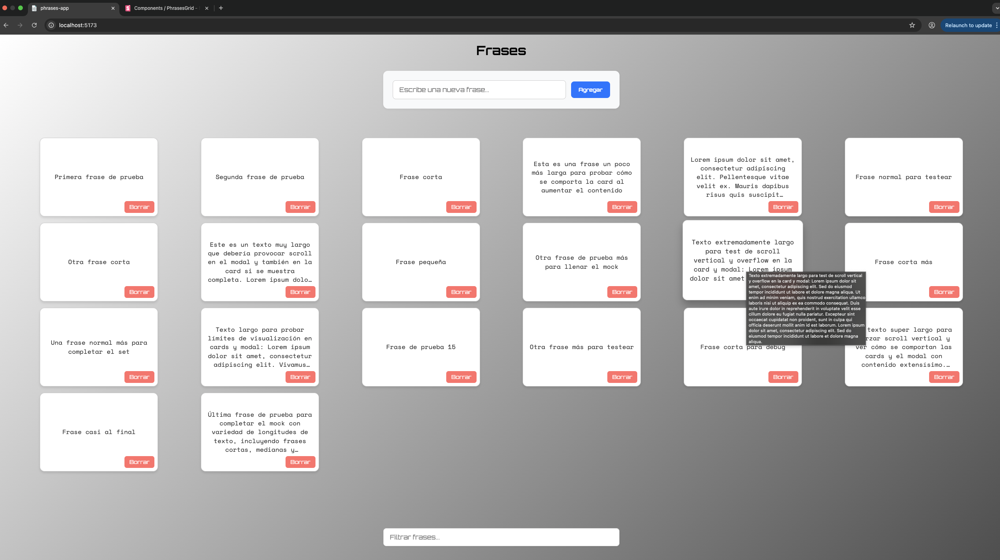
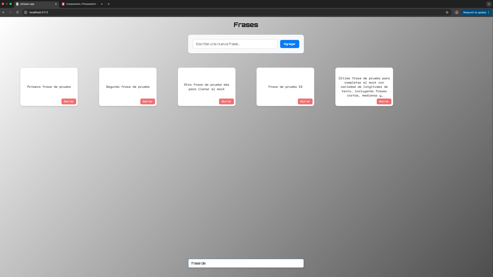
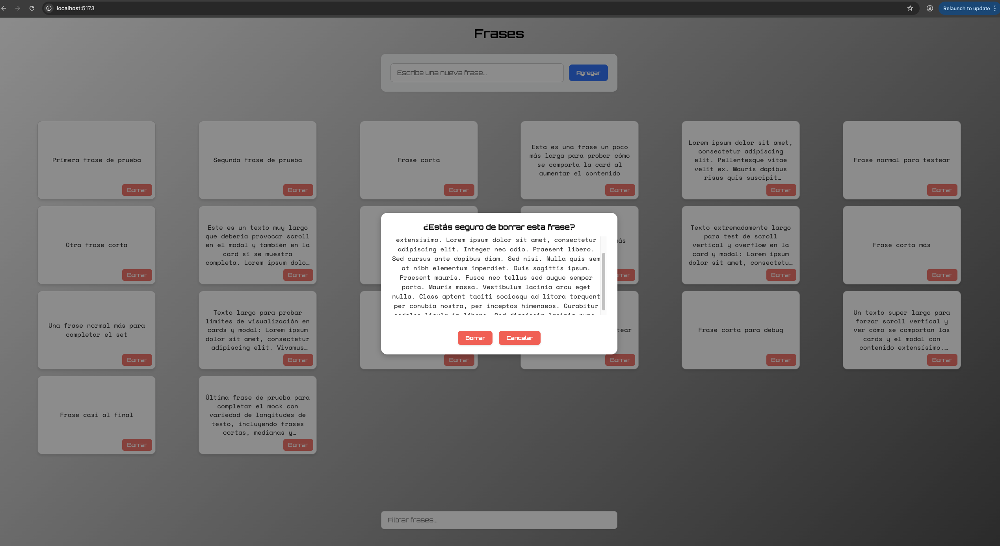
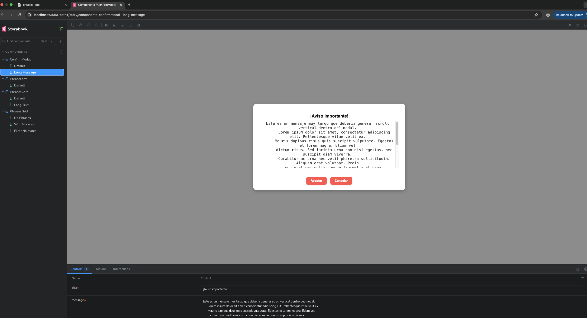

# 📝 Frases App

**Frases App** es una aplicación web desarrollada con **React + TypeScript + Vite**, diseñada para gestionar y filtrar frases.  
Permite agregar, eliminar y filtrar frases de manera interactiva, utilizando buenas prácticas de desarrollo moderno: context, hooks personalizados, manejo de errores con `try/catch`, testing y más.

---

## 🚀 Tecnologías y herramientas

- ⚛️ **React 19** con **TypeScript**  
- 🔧 **Node.js** version 20.19+ or 22.12+
- ⚡ **Vite** como bundler y servidor de desarrollo con HMR  
- 🎨 **Styled Components** para estilos dinámicos y modulares  
- 🌐 **Context API** para manejo de estado global (`PhrasesContext`)  
- 🪝 **Custom Hooks** (`usePhrases`, `useEmptyState`) para lógica reutilizable  
- ⏱️ **Async / Await + Try / Catch** para manejo de operaciones asincrónicas  
- 📚 **Storybook** para documentación y visualización de componentes  
- 🧪 **Jest + React Testing Library** para tests unitarios e integración  
- 🔧 **ESLint + Prettier** para linting y formateo automático  
- 🐶 **Husky** + **lint-staged** para ejecutar lint, prettier y tests en cada commit  
- 🌐 **Servidor local Express** (`server.js`) para simulación de backend
- 🤝 **Concurrently** para levantar servidor y frontend en paralelo

---

## ✨ Funcionalidades principales

- ➕ Agregar nuevas frases mediante un formulario.  
- 🔍 Filtrar frases existentes en tiempo real.  
- ❌ Eliminar frases individualmente.  
- 💭 Mensaje cuando no hay frases: `"No hay frases disponibles aún"`  
- 🔎 Mensaje cuando el filtro no coincide con ninguna frase: `"No se encontraron frases que contengan: {texto del filtro}"`  
- 🖼️ Grid de frases con **scroll interno** cuando la cantidad de frases excede la altura disponible, manteniendo siempre **formulario arriba** y **filtro abajo** visibles.  

#### Matriz de Frases



#### Matriz de Frases con busqueda



#### Matriz Modal Borrar



---

## 🏗️ Estructura y buenas prácticas

- `components/` → Componentes React modulares (`PhrasesGrid`, `PhrasesCard`, `PhraseForm`, `PhraseFilter`)  
- `context/` → Context API y hooks (`PhrasesContext`, `usePhrases`)  
- `hooks/` → Custom hooks (`useEmptyState`)  
- `styles/` → Styled Components
- `server.js` → Servidor Express para simular endpoints de frases  

## Instalación y ejecución

Clonar el repositorio y entrar en la carpeta del proyecto:

```bash
git clone https://github.com/alejandromoises02/frases-app.git
cd frases-app
npm install
npm run start
```

npm run start permite la ejecución de
```npm run dev``` (ui)
y ```npm run server``` (servidor local)
los cuales tambien se pueden ejecutar por separado

## Tests

```npm run test```

## Storybook

```npm run storybook```


