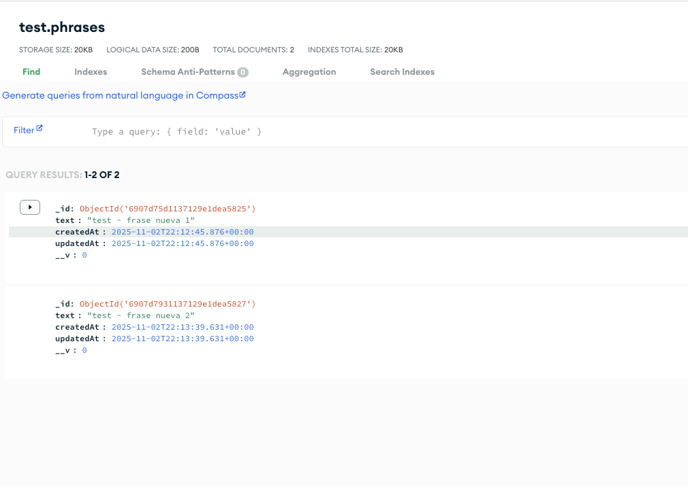
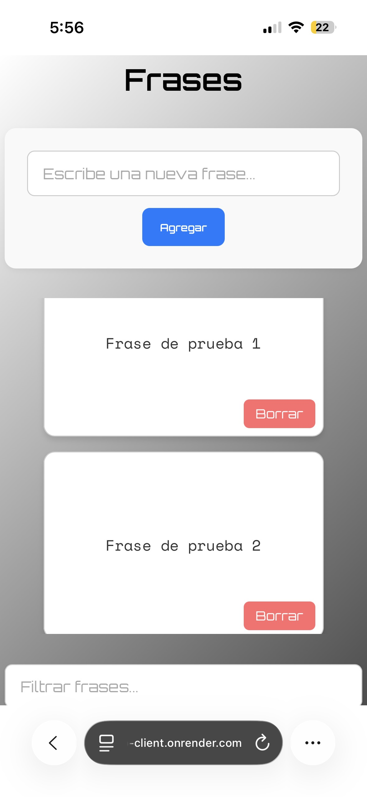
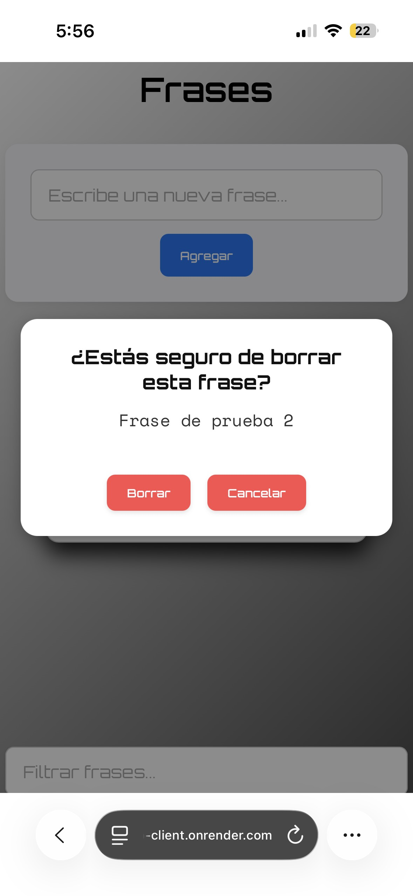
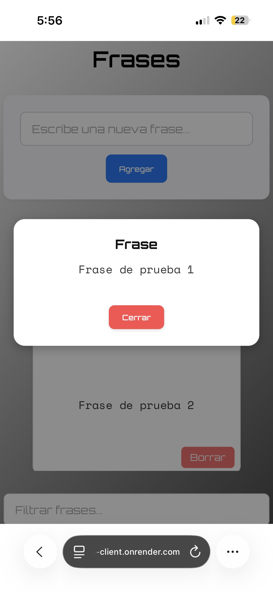

# 📝 Frases App

**Frases App** es una aplicación web desarrollada con **React + TypeScript + Vite**, diseñada para gestionar y filtrar frases.  
Permite agregar, eliminar y filtrar frases de manera interactiva, utilizando buenas prácticas de desarrollo moderno: context, hooks personalizados, manejo de errores con `try/catch`, testing y más.

---

## Instalación y ejecución

Clonar el repositorio y entrar en la carpeta del proyecto:

```bash
git clone https://github.com/alejandromoises02/frases-app.git
cd frases-app
npm install
npm run start
```

npm run start permite la ejecución de
```npm run dev``` (ui)
y ```npm run server``` (servidor local)
los cuales tambien se pueden ejecutar por separado

---

## 🌐 Demo / Deploy

La aplicación está desplegada en línea:

- **Servidor (API)**: [https://phrases-app.onrender.com](https://phrases-app.onrender.com)  
  Aquí se almacenan y gestionan todas las frases de la matriz.

- **Interfaz de Usuario (UI)**: [https://phrases-app-client.onrender.com](https://phrases-app-client.onrender.com)  
  Interactúa con la matriz de frases, agrega, busca y elimina frases directamente desde la web.

> ⚠️ Nota: Actualmente, todos los clientes comparten la misma lista de frases.

---

## 🧪 Tests y Coverage

```npm run test```

Badges SonarQuebe

 [](https://sonarcloud.io/summary/new_code?id=alejandromoises02_frases-app)
 [](https://sonarcloud.io/summary/new_code?id=alejandromoises02_frases-app)
 [](https://sonarcloud.io/summary/new_code?id=alejandromoises02_frases-app)

- El comando muestra cobertura en consola.
- Se agregó el workflow coverage: .github/workflows/coverage.yml que permite generar un reporte de cobertura HTML desplegado automáticamente en GitHub Pages(>80%): [Ver reporte](https://alejandromoises02.github.io/frases-app/)
- Se agregó el sonar: .github/workflows/coverage.yml y se configuro sonarqube para quality gates y coverage(>80%): [SonarQube](https://sonarcloud.io/summary/overall?id=alejandromoises02_frases-app&branch=main)

## Storybook

```npm run storybook```


---

## 🗄️ Base de datos integrada con MongoDB

El servidor Express está conectado a una base de datos MongoDB alojada en MongoDB Atlas, utilizando Mongoose para la gestión de los modelos y las operaciones CRUD.
Esto permite almacenar las frases de manera persistente y escalable, asegurando que las frases agregadas, eliminadas o consultadas se reflejen directamente en la base de datos.

### Base de Datos



---

## 🚀 Tecnologías y herramientas

- ⚛️ **React 19** con **TypeScript**  
- 🔧 **Node.js** version 20.19+ or 22.12+
- ⚡ **Vite** como bundler y servidor de desarrollo con HMR  
- 🎨 **Styled Components** para estilos dinámicos y modulares  
- 🌐 **Context API** para manejo de estado global (`PhrasesContext`)  
- 🪝 **Custom Hooks** (`usePhrases`, `useEmptyState`) para lógica reutilizable  
- ⏱️ **Async / Await + Try / Catch** para manejo de operaciones asincrónicas  
- 📚 **Storybook** para documentación y visualización de componentes  
- 🧪 **Jest + React Testing Library** para tests unitarios e integración  
- 🔧 **ESLint + Prettier** para linting y formateo automático  
- 🐶 **Husky** + **lint-staged** para ejecutar lint, prettier y tests en cada commit  
- 🌐 **Servidor local Express** (`server.js`) para simulación de backend
- 🤝 **Concurrently** para levantar servidor y frontend en paralelo
- 📱 **Mobile Friendly** adaptado para vista mobile

---

## ✨ Funcionalidades principales

- ➕ Agregar nuevas frases mediante un formulario.  
- 🔍 Filtrar frases existentes en tiempo real.  
- ❌ Eliminar frases individualmente.  
- 💭 Mensaje cuando no hay frases: `"No hay frases disponibles aún"`  
- 🔎 Mensaje cuando el filtro no coincide con ninguna frase: `"No se encontraron frases que contengan: {texto del filtro}"`  
- 🖼️ Grid de frases con **scroll interno** cuando la cantidad de frases excede la altura disponible, manteniendo siempre **formulario arriba** y **filtro abajo** visibles.  

### Matriz de Frases


### Matriz de Frases con busqueda


### Matriz Modal Borrar


### Matriz Mobile Ejemplos





---

## 🏗️ Estructura y buenas prácticas

- `components/` → Componentes React modulares (`PhrasesGrid`, `PhrasesCard`, `PhraseForm`, `PhraseFilter`)  
- `context/` → Context API y hooks (`PhrasesContext`, `usePhrases`)  
- `hooks/` → Custom hooks (`useEmptyState`)  
- `styles/` → Styled Components
- `server.js` → Servidor Express para simular endpoints de frases  
